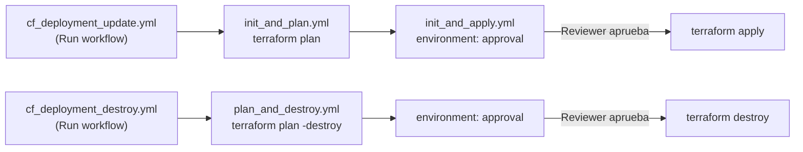

# dojogiraveraguas2026

Material didáctico para el despliegue de una arquitectura **RAG (Retrieval-Augmented Generation)** en Azure usando **Terraform** y **GitHub Actions**. El objetivo del repositorio es que el estudiante aprenda a:

1. Definir infraestructura como código (IaC) con Terraform.
2. Automatizar el ciclo de vida (plan → apply → destroy) con GitHub Actions.
3. Autenticarse en Azure sin secretos usando **OIDC (OpenID Connect)**.
4. Proteger un despliegue productivo con un **environment de aprobación manual**.

---

## 1. Estructura del repositorio

```
dojogiraveraguas2026/
├── terraform/                     # Infraestructura como código (Terraform)
│   ├── 0_backend.tf                # Backend remoto (Azure Storage) y versiones de providers
│   ├── 0_data.tf                   # Data sources (resource group existente, identidad actual)
│   ├── 0_providers.tf              # Configuración de los providers azurerm y azapi
│   ├── 0_variables.tf              # Declaración de variables de entrada
│   ├── 1_locals.tf                 # Valores locales (tags comunes)
│   ├── 1_random.tf                 # Sufijo aleatorio para nombres únicos de recursos
│   ├── 2_outputs.tf                # Salidas del plan (nombres, endpoints, IDs)
│   ├── 3_storage.tf                # Storage Account + contenedor Blob
│   ├── 4_key_vault.tf              # Azure Key Vault (RBAC habilitado)
│   ├── 5_ai_services.tf            # Azure AI Services + deployment de modelo OpenAI (GPT-5)
│   ├── 6_ai_foundry.tf             # Azure AI Foundry Hub + Project
│   ├── 7_ai_connector.tf           # Conexión (API Key) entre el Hub de AI Foundry y AI Services
│   └── terraform.tfvars            # Valores concretos de las variables para este ambiente
└── .github/
    ├── AZURE_RUNNER_SECRETS.md     # Guía para crear el Service Principal y configurar OIDC
    └── workflows/
        ├── cf_deployment_update.yml   # Orquestador: Plan + Apply (botón "Run workflow")
        ├── cf_deployment_destroy.yml  # Orquestador: Destroy (botón "Run workflow")
        ├── init_and_plan.yml          # Workflow reutilizable: terraform init + plan
        ├── init_and_apply.yml         # Workflow reutilizable: aprobación + terraform apply
        ├── plan_and_destroy.yml       # Workflow reutilizable: plan -destroy + aprobación + destroy
        ├── check_secrets.yml          # Verifica que los secrets de Azure existan en el repo
        ├── terraform_formatting.yml   # Chequea formato (terraform fmt -check) en cada push a main
        └── terraform_validate.yml     # Valida sintaxis (terraform validate) en cada push a main
```

### ¿Qué hace cada archivo de Terraform?

| Archivo | Propósito |
|---|---|
| `0_backend.tf` | Define dónde se guarda el *state* de Terraform (Storage Account de Azure) usando autenticación OIDC + Azure AD, y fija las versiones de los providers `azurerm`, `azapi` y `random`. |
| `0_data.tf` | Lee (no crea) el resource group indicado en `resource_group_name` y obtiene el `tenant_id`/`object_id` del usuario o Service Principal que ejecuta Terraform. |
| `0_providers.tf` | Configura el provider `azurerm` (con soft-delete deshabilitado para Key Vault y Cognitive Services) y el provider `azapi` para recursos que aún no tienen soporte nativo. |
| `0_variables.tf` | Declara todas las variables de entrada (nombres de recursos, SKUs, región, modelo de OpenAI, etc.) con su tipo y descripción. |
| `1_locals.tf` | Combina tags por defecto (`environment`, `workload`) con las tags personalizadas del usuario. |
| `1_random.tf` | Genera un sufijo aleatorio de 3 caracteres para evitar colisiones de nombres globales (Storage Account, Key Vault, etc.). |
| `2_outputs.tf` | Expone valores útiles después del `apply`: nombre del resource group, storage account, Key Vault URI, nombre del Hub/Project de AI Foundry. |
| `3_storage.tf` | Crea el Storage Account y el contenedor Blob donde se guardan los documentos usados por el RAG. |
| `4_key_vault.tf` | Crea el Key Vault con autorización por RBAC y asigna el rol `Key Vault Administrator` al usuario/SP que despliega. |
| `5_ai_services.tf` | Crea el recurso de Azure AI Services (kind `AIServices`) con identidad administrada y despliega el modelo de Azure OpenAI (por defecto GPT-5). |
| `6_ai_foundry.tf` | Crea el Hub y el Project de Azure AI Foundry, y le da permisos (`Key Vault Secrets Officer`) al Hub sobre el Key Vault. |
| `7_ai_connector.tf` | Usa el provider `azapi` para crear la conexión "API Key" entre el Hub de AI Foundry y el recurso de AI Services, necesaria para que el Hub consuma el modelo. |
| `terraform.tfvars` | Valores reales para este ambiente (nombres de recursos, región `eastus2`, modelo `gpt-5-nano`, etc.). El `subscription_id` **no** se pone aquí: se inyecta desde GitHub Secrets. |

---

## 2. Cómo configurar el proyecto (paso a paso)

### 2.1 Prerrequisitos
- Cuenta de Azure con permisos para crear un *App Registration* / Service Principal.
- Un Storage Account existente para el backend remoto de Terraform (state file).
- Un resource group existente (Terraform lo lee, no lo crea) — ver `resource_group_name` en `terraform.tfvars`.
- Repositorio en GitHub con Actions habilitado.

### 2.2 Configurar el backend remoto
Edita `terraform/0_backend.tf` con los datos de tu Storage Account:

```hcl
backend "azurerm" {
  resource_group_name  = "<rg-donde-esta-el-storage>"
  storage_account_name = "<nombre-storage-account>"
  container_name        = "<contenedor-para-el-state>"
  key                   = "terraform.tfstate"
  use_oidc              = true
  use_azuread_auth      = true
}
```

### 2.3 Ajustar variables del ambiente
Edita `terraform/terraform.tfvars` con los nombres de recursos que quieras usar (Storage Account, Key Vault, AI Services, AI Foundry, modelo de OpenAI, región, etc.). **No** agregues el `subscription_id` aquí: llega automáticamente desde el workflow como `TF_VAR_subscription_id`.

### 2.4 Crear el Service Principal con OIDC (sin secretos)
Sigue la guía completa en [.github/AZURE_RUNNER_SECRETS.md](.github/AZURE_RUNNER_SECRETS.md). En resumen:

```bash
az login
az ad sp create-for-rbac --name "github-actions-sp-dojogiraveraguas2026" \
  --role "Contributor" --scopes "/subscriptions/$SUBSCRIPTION_ID"

az ad app federated-credential create --id "$CLIENT_ID" --parameters '{
  "name": "github-oidc-main",
  "issuer": "https://token.actions.githubusercontent.com",
  "subject": "repo:soysoliscarlos/dojogiraveraguas2026:ref:refs/heads/main",
  "audiences": ["api://AzureADTokenExchange"]
}'
```

### 2.5 Configurar los secrets del repositorio
Con el `gh` CLI (o desde Settings → Secrets and variables → Actions):

```bash
gh secret set AZURE_CLIENT_ID       --body "$CLIENT_ID"       --repo soysoliscarlos/dojogiraveraguas2026
gh secret set AZURE_TENANT_ID       --body "$TENANT_ID"       --repo soysoliscarlos/dojogiraveraguas2026
gh secret set AZURE_SUBSCRIPTION_ID --body "$SUBSCRIPTION_ID" --repo soysoliscarlos/dojogiraveraguas2026
```

Puedes verificar que estén configurados ejecutando manualmente el workflow **Check Required Secrets** (`check_secrets.yml`) desde la pestaña *Actions*.

### 2.6 Ejecutar el despliegue
1. Ve a la pestaña **Actions** del repositorio.
2. Selecciona el workflow **Infrastructure Deployment** (`cf_deployment_update.yml`).
3. Haz clic en **Run workflow** sobre la rama `main`.
4. El pipeline corre en dos fases (ver diagrama abajo): primero `terraform plan`, luego pide **aprobación manual** y finalmente ejecuta `terraform apply`.

Para eliminar la infraestructura, ejecuta de la misma forma el workflow **Infrastructure Destroy** (`cf_deployment_destroy.yml`), que también pasa por el mismo *gate* de aprobación antes de correr `terraform destroy`.

### 2.7 Flujo de los pipelines



Adicionalmente, en cada `push` a `main` corren automáticamente (sin necesidad de aprobación, son solo validaciones):
- **`terraform_formatting.yml`**: falla si el código no está formateado (`terraform fmt -check -recursive`).
- **`terraform_validate.yml`**: falla si la sintaxis de Terraform no es válida (`terraform validate`).

---

## 3. Configuración del ambiente `approval` (aprobación manual)

Los workflows reutilizables `init_and_apply.yml` y `plan_and_destroy.yml` incluyen un job llamado `approval` que apunta al **GitHub Environment** `approval`:

```yaml
approval:
  name: 'Approval'
  if: github.ref_name == 'main'
  runs-on: ubuntu-latest
  environment: approval
  steps:
    - name: Approval Step
      run: echo "${{ github.event.review.state }}"
```

Por sí solo, declarar `environment: approval` **no detiene el pipeline** — solo lo hace si ese environment tiene una regla de protección de tipo *Required reviewers* configurada en GitHub. Esta configuración **no vive en el código**, vive en la configuración del repositorio, y se hizo con `gh api` (GitHub REST API) porque el `gh` CLI no tiene un comando nativo para esto todavía.

### 3.1 ¿Por qué es importante?
Sin esta regla, el job `approval` se marca como exitoso automáticamente y el pipeline continúa directo hacia `terraform apply` o `terraform destroy` sin que nadie revise el `plan`. Con la regla activa, el job queda en estado **Waiting** hasta que un revisor autorizado lo apruebe desde la pestaña *Actions*.

### 3.2 Cómo se configuró (comandos de referencia)

**a) Verificar el estado actual del environment:**
```bash
gh api repos/soysoliscarlos/dojogiraveraguas2026/environments
```

**b) Obtener el ID del usuario que actuará como revisor:**
```bash
gh api user --jq '.login, .id'
```

**c) Aplicar la regla de "required reviewers" al environment `approval`:**
```bash
gh api --method PUT repos/soysoliscarlos/dojogiraveraguas2026/environments/approval \
  -f "reviewers[][type]=User" \
  -F "reviewers[][id]=7979619" \
  -F "deployment_branch_policy=null"
```

Esto agrega una `protection_rule` de tipo `required_reviewers` con el usuario indicado como aprobador obligatorio.

### 3.3 Cómo aprobar un despliegue en curso
1. Ve a **Actions** → selecciona la ejecución en progreso.
2. En el job **Approval** verás el botón **Review deployments**.
3. Marca el environment `approval`, agrega un comentario opcional y presiona **Approve and deploy** (o **Reject** para detener el pipeline).

### 3.4 Puntos clave para recordar
- La regla se aplica al **nombre del environment** (`approval`), no a un workflow en particular: por eso protege tanto el `apply` (deploy) como el `destroy`.
- Se puede agregar más de un revisor; también existen opciones para restringir por rama (`deployment_branch_policy`) o agregar un temporizador de espera (`wait_timer`).
- `can_admins_bypass: true` significa que los administradores del repositorio pueden saltarse la aprobación — útil en clase para desatascar una demo, pero no recomendado en un ambiente productivo real.

---

## 4. Recursos de Azure que se crean

| Recurso | Descripción |
|---|---|
| Storage Account + Container | Almacena los documentos/artefactos usados por el flujo RAG. |
| Key Vault (RBAC) | Guarda secretos y llaves; el usuario que despliega recibe el rol `Key Vault Administrator`. |
| Azure AI Services + deployment OpenAI | Expone el modelo de lenguaje (por defecto `gpt-5-nano`) que consumirá la aplicación. |
| Azure AI Foundry Hub + Project | Espacio de trabajo donde se organizan los modelos, conexiones y proyectos de IA. |
| Conexión AI Foundry ↔ AI Services | Vincula el Hub con el recurso de AI Services usando autenticación por API Key. |

---

## 5. Buenas prácticas que ilustra este repositorio
- **Autenticación sin secretos** (OIDC federado) en lugar de client secrets rotables.
- **Separación de responsabilidades**: workflows "orquestadores" (`cf_deployment_*.yml`) vs. workflows "reutilizables" (`init_and_*.yml`, `plan_and_destroy.yml`).
- **Validación temprana**: formato y sintaxis se revisan en cada `push`, antes de intentar un despliegue.
- **Control de cambios productivos**: ningún `apply` o `destroy` ocurre sin una aprobación humana explícita.
